# 🏏 IPL Smart Analytics Dashboard

## 🌐 Live App

👉 https://ipl-recommendation-system-trbwouvmvtbkypxupqwzlu.streamlit.app/

## 🎥 Demo Video

👉 https://youtu.be/L6WHxP1W2pg?si=KM-G2qVdOAd7SAKJ

---

## 📌 Overview

This project is an advanced IPL Analytics Dashboard that provides personalized match recommendations and detailed insights into team and player performance.

It helps users explore IPL data interactively and discover exciting matches based on multiple factors like rivalry, match closeness, and team performance.

---

## 🚀 Features

### ⭐ Smart Match Recommendation

* Recommends matches using scoring logic
* Considers rivalry, match margin, and performance

### 📊 Team Analysis

* Matches played
* Wins
* Win rate

### 🔥 Recent Matches

* Latest matches for selected team

### ⚔️ Head-to-Head Analysis

* Compare performance between two teams

### 🏏 Player Insights

* Top batsmen
* Top bowlers
* Player search (case-insensitive)

### 🏟️ Venue Analysis

* Stadium-wise winning trends

### 🪙 Toss Impact

* Toss vs match result analysis

### 📈 Data Visualization

* Interactive charts using Matplotlib

---

## 🛠️ Tech Stack

* Python
* Pandas
* NumPy
* Matplotlib
* Streamlit

---

## 📂 Project Structure

```
ipl-recommendation-system/
│── App.py
│── matches.csv
│── deliveries.zip
│── requirements.txt
│── README.md
```

---

## ⚙️ How to Run Locally

```bash
pip install -r requirements.txt
streamlit run App.py
```

---

## 📸 Screenshots

### 🏠 Dashboard

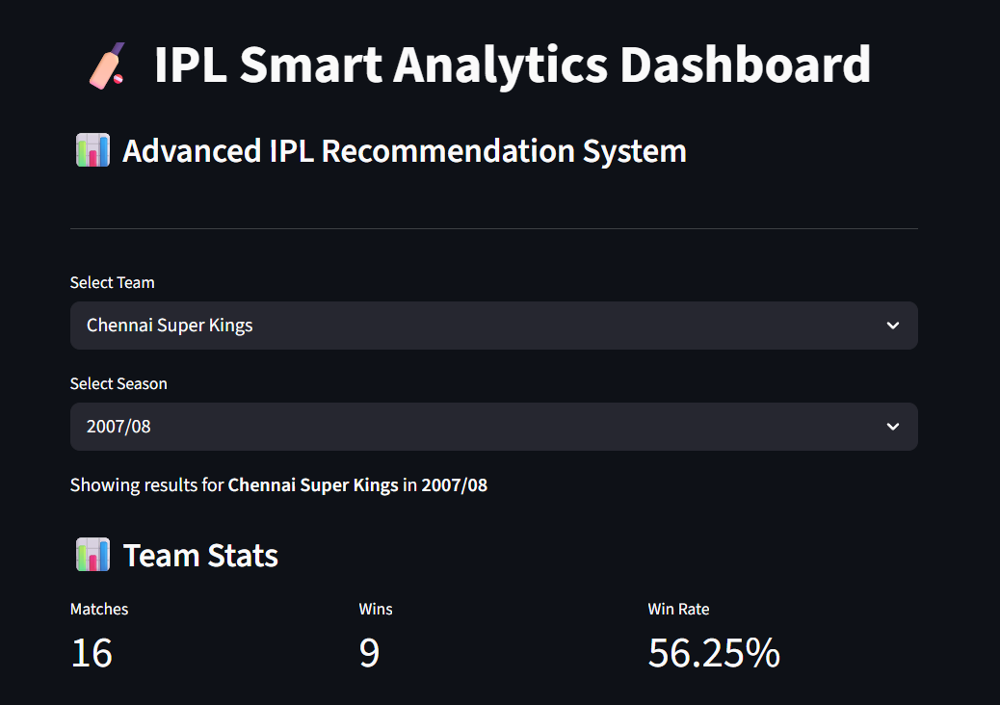

### 🎯 Team & Season Selection

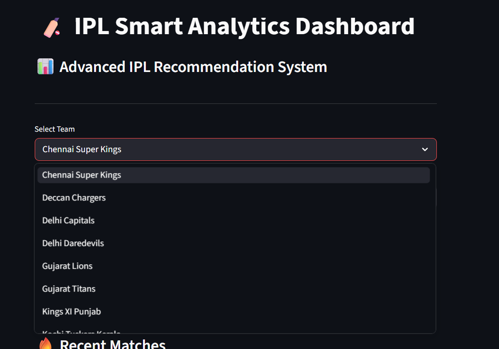
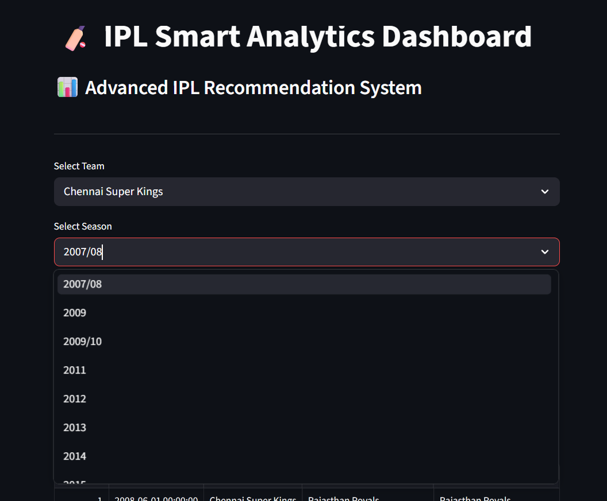

### 📊 Matches

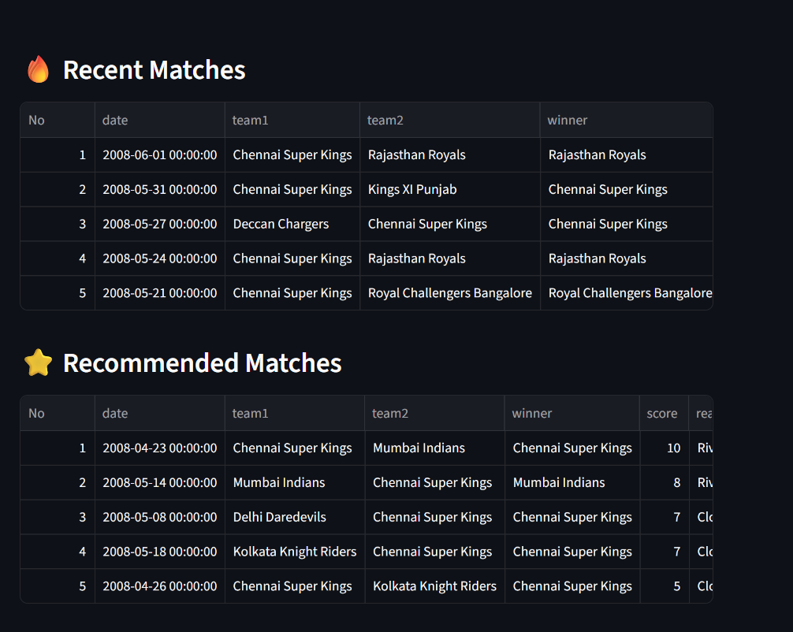

### ⭐ Recommendation

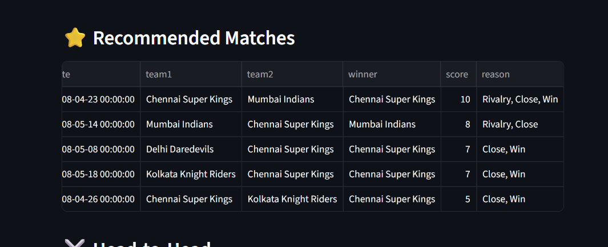

### ⚔️ Head-to-Head

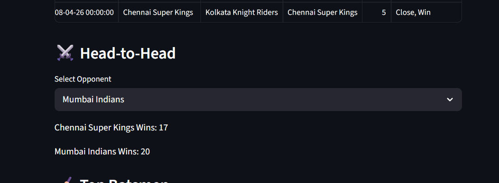

### 🏏 Top Batsmen

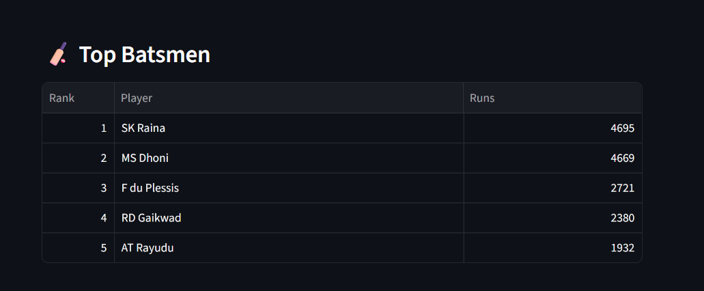

### 📈 Performance

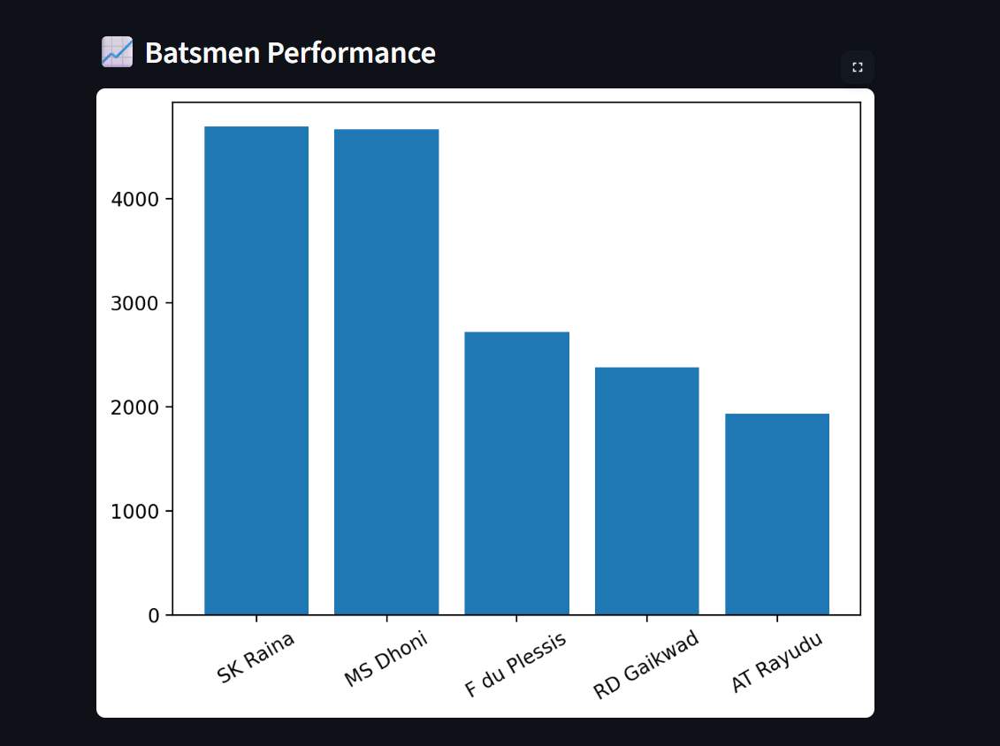

### 🎯 Top Bowlers

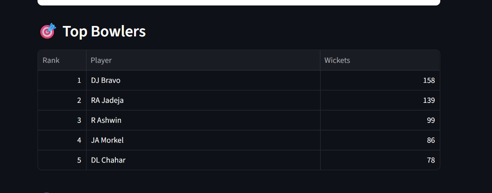

### 🔍 Player Search

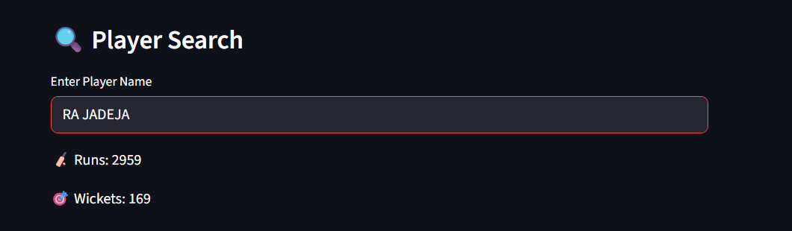

### 🏟️ Venue Analysis

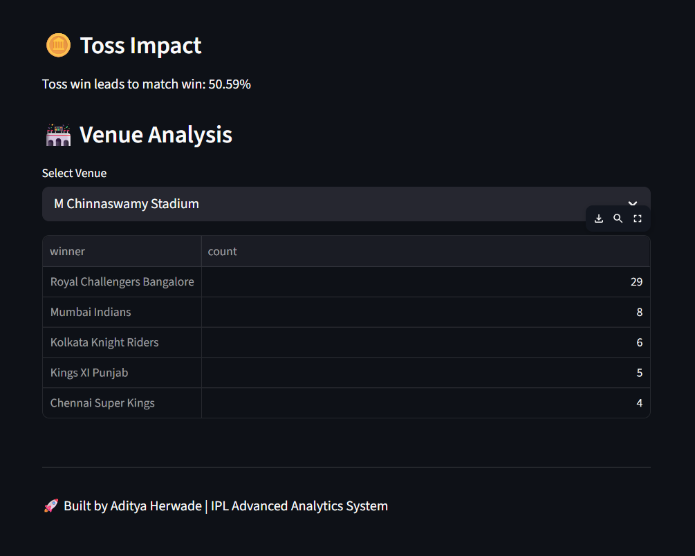

---

## 💡 Key Highlights

* Built end-to-end data analysis project
* Designed rule-based recommendation system
* Developed interactive dashboard UI
* Implemented real-world analytics features

---

## 👨‍💻 Author

**Aditya Herwade**

---

## ⭐ If you like this project

Give it a ⭐ on GitHub!
